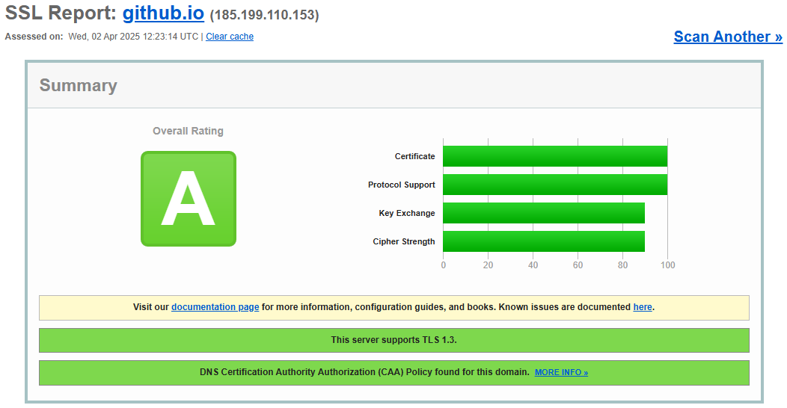
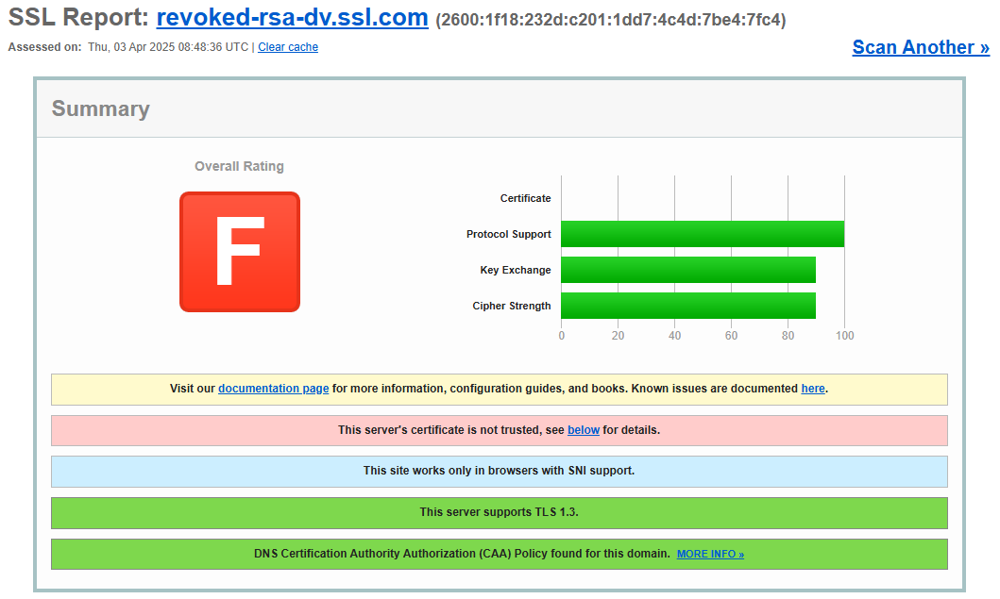
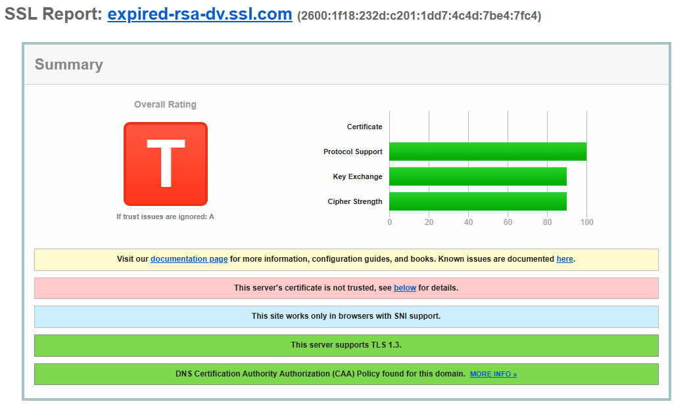
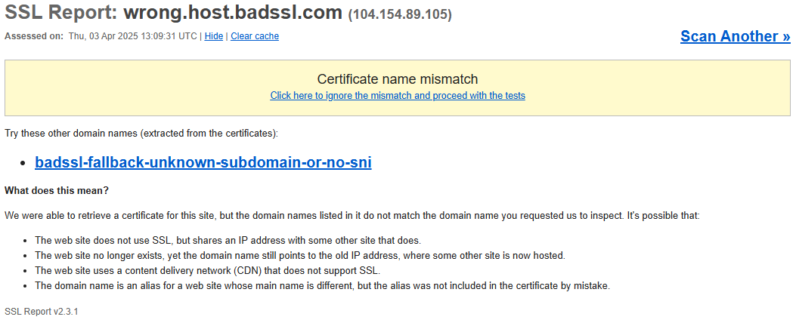

# Parte 3: Análisis de Certificados SSL/TLS

## Certificado Válido: `github.io` (Calificación A)

### Factores de validez según metodología SSL Labs

#### 1. Verificación del certificado  
- **Emisor confiable**: Certificado emitido por *Sectigo RSA Domain Validation Secure Server CA*, una autoridad reconocida por la mayoría de los navegadores modernos.  
- **Validez temporal**: El certificado es válido dentro de las fechas establecidas (`notBefore` y `notAfter`).  
- **Cadena de certificación completa**: Incluye certificados intermedios hasta la autoridad raíz reconocida por Mozilla, permitiendo la validación sin advertencias.

#### 2. Características destacadas  
- **Perfect Forward Secrecy (PFS)**: Implementado mediante *ECDHE*, garantizando que una posible exposición de la clave privada no comprometa sesiones anteriores.  
- **HSTS (HTTP Strict Transport Security)**: Configurado con la cabecera `Strict-Transport-Security` y `max-age=31536000`, previniendo ataques de *downgrade* a HTTP.  
- **CAA (Certification Authority Authorization)**: Se verifica que la configuración DNS restringe la emisión de certificados a autoridades autorizadas, evitando certificaciones fraudulentas.  

---

## Certificados No Válidos: Análisis Comparativo

### 1. Certificado Revocado: `revoked-rsa-dv.ssl.com` (Calificación F)

#### Motivos de invalidez  
- **Revocación por la Autoridad de Certificación (CA)**: El certificado aparece en la *Lista de Revocación de Certificados* (CRL) y en el servicio *Online Certificate Status Protocol* (OCSP) como revocado.  
- **Impacto**: Un certificado revocado recibe una calificación de 0 en la validación SSL.  
- **Riesgo**: La revocación puede deberse a la exposición de la clave privada, uso indebido o una solicitud del propietario.  

---

### 2. Certificado Expirado: `expired-rsa-dv.ssl.com` (Calificación T)

#### Motivos de invalidez  
- **Validez temporal vencida**: El campo `notAfter` indica que expiró el 2023-12-31, lo que significa que el certificado es inválido desde hace más de seis meses.  
- **Consecuencias**:  
  - Los navegadores modernos bloquean el acceso con el error `NET::ERR_CERT_DATE_INVALID`.  
  - SSL Labs asigna la calificación "T" (*Trust issues*) debido a la rotura de la cadena de confianza.  

---

### 3. Error de Nombre: `wrong.host.badssl.com` (Calificación M)

#### Motivos de invalidez  
- **Incompatibilidad con el dominio accedido**:  
  - El certificado fue emitido para `*.badssl.com` (cubre subdominios, pero no todos los casos).  
  - Sin embargo, el dominio `wrong.host.badssl.com` no está dentro de los *Subject Alternative Names* (SAN), lo que provoca el error.  
- **Verificación SNI (Server Name Indication)**: El servidor no entrega el certificado correcto durante el handshake TLS.  
- **Efecto**: Los navegadores devuelven el error `NET::ERR_CERT_COMMON_NAME_INVALID`, indicando que el dominio del certificado no coincide con el sitio accedido.  